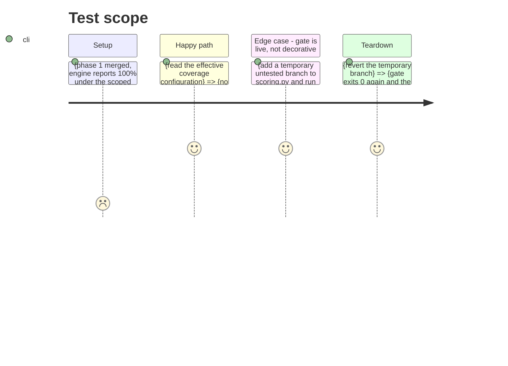

# Instruction: Remove the dead override, wire the gate

## Architecture projection

> Tree of the final files. ✅ create · ✏️ modify · ❌ delete

```txt
.
├── pyproject.toml                   ✏️ delete the `[[tool.coverage.overrides]]` block (lines 160-162)
└── .github/workflows/ci.yml         ✏️ add the engine coverage gate as a step in the `test` job
```

Nothing is created or deleted in this phase. It removes the configuration that pretends to enforce the gate and adds the one that does.

## Test Scope



## Tasks to do

### `1)` Delete the `[[tool.coverage.overrides]]` block from `pyproject.toml`

> The block at lines 160-162 sets `module = "laivelup.scoring"` and `fail_under = 100`. coverage.py has no `[overrides]` feature at any released version, so these two lines are read, warned about never, and discarded.

1. Open `pyproject.toml` and remove the `[[tool.coverage.overrides]]` table and its two keys, leaving the surrounding blank-line structure intact.
2. Change nothing else in the file. In particular leave `[tool.coverage.run] source = ["src/laivelup", "scripts"]`, `omit`, `[tool.coverage.report] exclude_lines`, and the pytest `addopts` `--cov-fail-under=85` exactly as they are.
3. Do not replace it with an inline comment claiming the gate now lives elsewhere; phase 3 is where the reasoning is recorded.

### `2)` Add the engine coverage gate to the `test` job in CI

> One pytest run has one coverage `source`. Scoping the gate to a different scope than the global 85% pass therefore needs its own run.

1. Open `.github/workflows/ci.yml` and locate the `test` job, which currently runs `pytest -q --tb=short` around line 40.
2. Add a step named for the engine coverage gate immediately after it, running `pytest -q -o addopts="" --cov=laivelup.scoring --cov-branch --cov-fail-under=100 --cov-report=term-missing`.
3. Use the module form `--cov=laivelup.scoring`. The path form collects nothing, reports `0.00%`, and fails with a `module-not-imported` warning instead of an obvious usage error.
4. Keep `-o addopts=""` so the shared `addopts` and its global `--cov=src/laivelup --cov=scripts` do not override the gate's scope and threshold.
5. Run the step over the **full** suite. Scoping it to `tests/test_scoring*.py` reports `scoring.py:187` as uncovered, because the refusal arm is exercised by tests outside that subset.
6. Leave `.pre-commit-config.yaml` untouched — its fast subset deliberately runs `--no-cov`, and this gate costs ~97s per commit.
7. Leave the `security` and `install` jobs alone.

### `3)` Prove the gate fails when it should

> A gate never observed failing is not known to be a gate.

1. Run `coverage debug config` and confirm `fail_under: 0.0` with no override machinery — the removal is complete and nothing was silently reintroduced.
2. Add a temporary, trivially unreachable `if False:` branch to `src/laivelup/scoring.py`.
3. Run the gate command and confirm it exits non-zero and names the new gap in `Missing`.
4. Revert the temporary branch and confirm the gate exits 0 again.
5. Record both outputs. They are the only evidence that distinguishes a working gate from a comment.
6. Run the unchanged global gate, `pytest -q`, and confirm it still reports `Required test coverage of 85% reached`.

## Test acceptance criteria

| Task | Acceptance criteria                                                                                                                                                                          |
| ---- | --------------------------------------------------------------------------------------------------------------------------------------------------------------------------------------------- |
| 1    | `pyproject.toml` contains no `tool.coverage.overrides` key anywhere.                                                                                                                          |
| 1    | `pytest -q` still reports `Required test coverage of 85% reached`, and `[tool.coverage.run] source` still lists both `src/laivelup` and `scripts`.                                           |
| 2    | The `test` job in `ci.yml` contains a step running the engine gate with `-o addopts=""`, `--cov=laivelup.scoring`, `--cov-branch`, and `--cov-fail-under=100`.                                   |
| 2    | That step's command, run locally on the same matrix image, exits 0 and reports 100% for `src/laivelup/scoring.py`.                                                                            |
| 2    | `.pre-commit-config.yaml` is byte-identical to its committed form.                                                                                                                              |
| 3    | With a temporary untested branch present, the gate command exits non-zero and names that branch in `Missing`.                                                                                  |
| 3    | After reverting it, the gate command exits 0 again.                                                                                                                                             |
| 3    | `coverage debug config` reports `fail_under: 0.0` and shows no override machinery.                                                                                                              |
