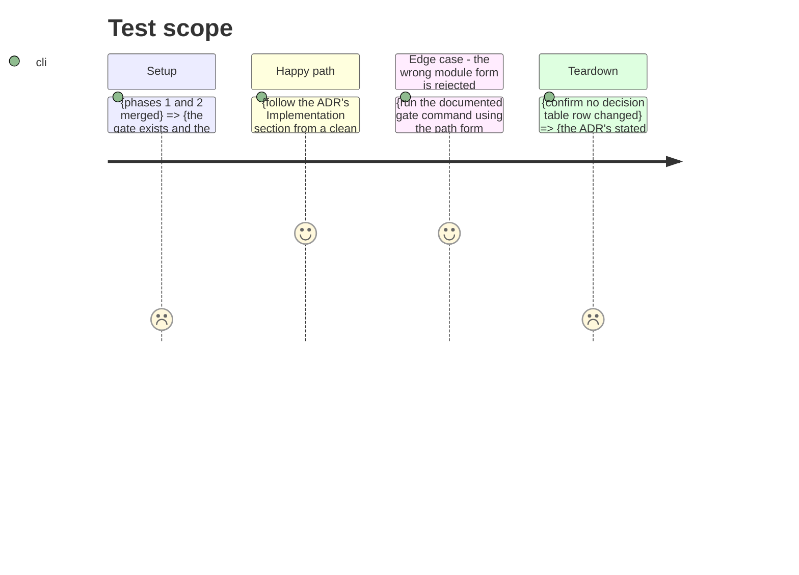

# Instruction: Correct ADR-0009

## Architecture projection

> Tree of the final files. ✅ create · ✏️ modify · ❌ delete

```txt
.
└── docs/adr/0009-couverture-scoring-100-autres-85-branch.md   ✏️ correct the Implementation section
```

Nothing is created or deleted in this phase. The decision ADR-0009 records is still the decision in force; only the mechanism it documents was never real.

## Test Scope



## Tasks to do

### `1)` Correct the Implementation section

> `docs/adr/0009-couverture-scoring-100-autres-85-branch.md:33-35` presents the `[[tool.coverage.overrides]]` block as the implementation of the 100% gate. coverage.py has no such feature, so the block did nothing.

1. Open the ADR and read the Décision table (lines 13-17) before editing. That table is the accepted decision and must not change.
2. Rewrite the Implémentation section to describe what phase 2 actually wired: the global `--cov-fail-under=85` in the pytest `addopts`, and the separate CI step gating `--cov=laivelup.scoring` at `--cov-fail-under=100`.
3. Record the fact that made the original section wrong: coverage.py has no `[overrides]` section, so the configuration was accepted, warned about never, and discarded. State that this was verified against `coverage` 7.11.3 and upstream at tags 7.4.0 through 7.11.3, where the feature never existed.
4. Note that the module form is required and the path form silently collects nothing, so the next reader does not reintroduce the mistake.
5. Keep the file's existing French section headings and its table format.

### `2)` Reconcile the Consequences section

> The ADR's Negatives cite "~180 tests, ~97% coverage", which predates the current suite, and its Liens section points at `pyproject.toml` as the only implementation site.

1. Update the test count and coverage figure in the Negatives to what the current suite reports after phase 1.
2. Add the CI workflow to the Liens list, so the reader can find the gate.
3. Change nothing in Status, Date, or Décideurs — the decision was accepted on 2026-08-22 and stands.

### `3)` Correct the audit record that repeats the claim

> `aidd_docs/tasks/2026_08/2026_08_31_audit/ce-testing.md:26` and `:153` both record the 100% override as verified. Left alone, they keep asserting a gate that never ran.

1. Append a dated correction note to `ce-testing.md` recording that the "scoring.py = 100% (override)" row rested on the dead `[overrides]` block, that the engine was in fact at 99%, and that issue #11 fixed it.
2. Leave the original rows in place. An audit record is a statement of what was believed on its date; rewriting it would destroy the evidence that the belief was wrong.
3. Do not edit any other audit document.

## Test acceptance criteria

| Task | Acceptance criteria                                                                                                                                                                       |
| ---- | ----------------------------------------------------------------------------------------------------------------------------------------------------------------------------------------- |
| 1    | The Implémentation section contains no `[tool.coverage.overrides]` snippet presented as working configuration.                                                                              |
| 1    | Every command named in the Implémentation section is one that runs, and the global 85% gate and the engine 100% gate are both named with their exact flags.                              |
| 1    | The ADR states plainly that coverage.py has no `[overrides]` section, and names the versions it was checked against.                                                                       |
| 2    | The Décision table, Status, Date, and Décideurs lines are identical to the committed version.                                                                                                |
| 3    | `ce-testing.md` carries a dated correction note, and its original rows are still present and unedited.                                                                                      |
